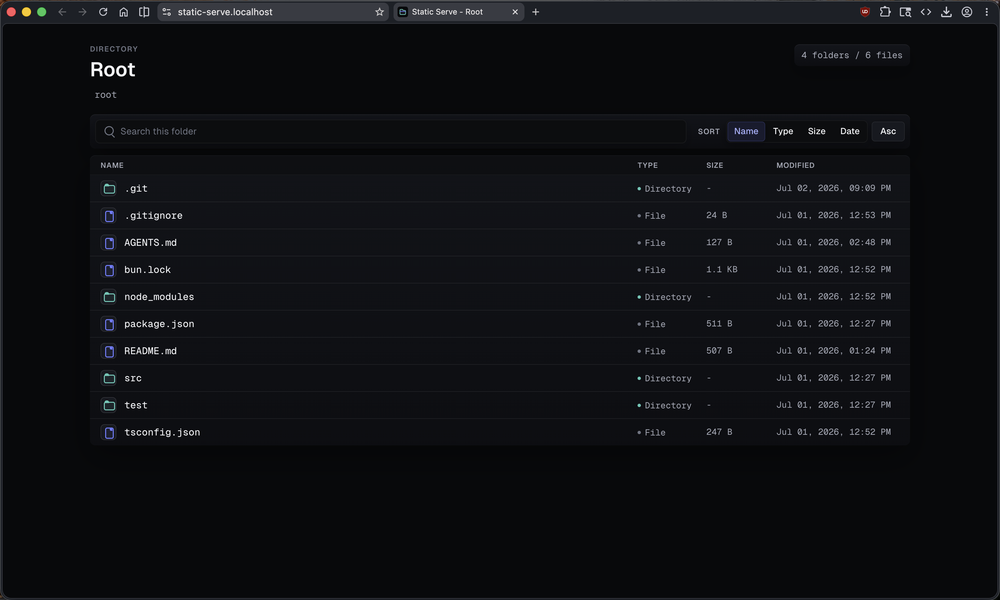

# static-serve

A small Bun static file server with a polished directory listing.

It serves files directly so the browser handles them normally. Directories render a dark, compact listing with full filename wrapping, current-folder search, sortable columns, breadcrumbs, and parent-folder navigation.



## Usage

```sh
bun install
bun src/cli.ts ./public --port 3000
```

Or through the package binary:

```sh
bunx static-serve ./public --port 3000
```

## Development

```sh
bun test
bun run typecheck
```
