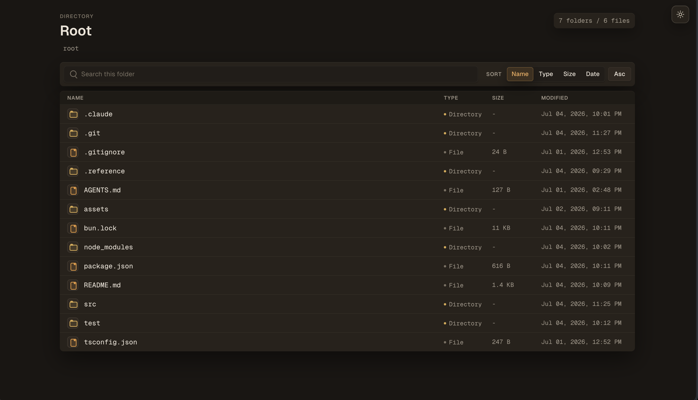

# static-serve

A small Bun static file server with a polished directory listing.

It serves files directly so the browser handles them normally. Directories render a dark, compact listing with full filename wrapping, current-folder search, sortable columns, breadcrumbs, and parent-folder navigation.



## Markdown rendering

`.md` and `.markdown` files are rendered on the fly into a styled HTML page (warm
"paper" theme) with full GitHub-Flavored Markdown — headings, tables, task lists,
blockquotes — and Shiki syntax highlighting for fenced code. Clicking a markdown
file in the listing shows a loader while the first render runs.

For richer documents, use the semantic patterns in
[docs/markdown-authoring.md](docs/markdown-authoring.md): callouts, quote blocks,
and responsive columns are written as Markdown/directives and rendered
consistently across light and dark themes.

- **Caching** — rendered HTML is memoized in-memory (LRU, keyed by a hash of the
  file path + contents) and served with a matching `ETag`. Repeat visits
  revalidate to a cheap `304`, and any edit produces a fresh key automatically.
- **Raw source** — append `?raw` to any markdown URL to get the original text
  instead of the rendered page.

## Usage

```sh
bun install
bun src/cli.ts ./public --port 3000
```

## Global install from this checkout

Until `static-serve` is published to a package registry, install it globally from
this repository:

```sh
bun install
bun link
```

Then use the package binary from anywhere:

```sh
static-serve ./public --port 3000
```

## Development

```sh
bun test
bun run typecheck
```
